# Loan Default Prediction Using a Distributed Big Data Pipeline

**Course:** 2026 Big Data Course, Innopolis University  
**Professor:** Alberto Sillitti  
**TA:** Firas Jolha  
**Date:** May 2026

**Team members:**  

- Egor Chernobrovkin, DS-02 (*[e.chernobrovkin@innopolis.university](mailto:e.chernobrovkin@innopolis.university)*)  
- Nikita Tiurkov, DS-02 (*[n.tiurkov@innopolis.university](mailto:n.tiurkov@innopolis.university)*)  
- Nurmukhammet Adagamov, DS-02 (*[n.adagamov@innopolis.university](mailto:n.adagamov@innopolis.university)*)  
- Saidaziz Kadirov, AI-02 (*[s.kadirov@innopolis.university](mailto:s.kadirov@innopolis.university)*)

---

## Introduction

The rapid growth of digital financial services has led to a significant increase in the volume of loan application data generated by lending platforms. Such data capture applicant profiles, loan terms, and repayment outcomes at a scale that makes distributed processing essential for financial institutions seeking to understand borrower behavior, evaluate credit risk, and support more consistent lending decisions.

In this project, we develop an end-to-end big data pipeline for loan default prediction using distributed data processing technologies. The pipeline covers the full workflow starting from raw data ingestion into a relational distributed database, transferring the data into Hadoop Distributed File System (HDFS), storing and preparing them in Hive, performing exploratory and predictive analytics with Spark, and visualizing the results in Apache Superset.

For the project, we use the Lending Club accepted loans dataset, which contains more than 2.2 million loan records and 151 raw attributes. The dataset includes financial, demographic, and historical credit-related information about borrowers, as well as the final loan outcome. This makes it suitable both for large-scale exploratory analysis and for building machine learning models for credit risk assessment.

The main focus of the project is binary classification: predicting whether an issued loan will be fully repaid or charged off, based only on the information available at the time of loan approval. This formulation reflects a realistic business scenario in which a lending institution needs to assess the probability of default before issuing a loan.

In addition to predictive modeling, the project also aims to provide meaningful analytical insights through data storytelling. The exploratory analysis helps identify patterns in loan performance across different borrower groups, loan characteristics, and time periods. These findings are then presented in an interactive dashboard designed for business stakeholders.

---

## Business Objectives

This project addresses three business objectives that are important for real-world lending platforms and banks.

1. **Reduce expected losses from loan defaults.**

The first objective is to identify risky loan applications before a loan is issued. If a lender can estimate default risk at the approval stage, it can make safer decisions, apply stricter verification to suspicious applications, or adjust loan terms. This objective is supported by the[Office of the Comptroller of the Currency (OCC)](https://www.occ.treas.gov/news-issuances/congressional-testimony/2011/pub-test-2011-92-written.pdf), a U.S. regulator that supervises national banks. The OCC explains that credit risk is one of the most important risks for banks and notes that loan losses have historically been a major reason for bank failures. 

2. **Make underwriting decisions more consistent and transparent.**

The second objective is to reduce reliance on ad hoc human judgment and make approval decisions more standardized. A data-driven model helps evaluate all applicants using the same criteria, which makes the process easier to scale and justify. This idea is directly supported by the [World Bank Credit Scoring Approaches Guidelines](https://thedocs.worldbank.org/en/doc/935891585869698451-0130022020/original/CREDITSCORINGAPPROACHESGUIDELINESFINALWEB.pdf), where credit scoring is described as a quick, consistent, and effective way to decide whether an applicant is eligible for a loan. 

3. **Provide clear portfolio-level analytics for stakeholders.**

The third objective is to help managers and analysts understand overall portfolio quality, default patterns, and changes over time. In practice, this means building a reproducible pipeline that produces reliable metrics and dashboard-ready outputs. This idea is consistent with the principles of the[Basel Committee on Banking Supervision (BCBS 239)](https://www.bis.org/publ/bcbs239.pdf), which emphasize that financial institutions should have accurate risk data and clear internal risk reporting to support better decision-making.

All three objectives are addressed through the binary classification pipeline described in the following sections.

---

## Data Description

The dataset used in this project is the **Lending Club accepted loans dataset** ([dataset link](https://www.kaggle.com/datasets/wordsforthewise/lending-club)). It contains historical records of issued loans together with their final repayment outcomes. Each record describes a loan that was approved by the platform and includes borrower-related, financial, and credit-history information available at the time of issuance.

For this project, only use the file `accepted_2007_to_2018Q4.csv`, which contains **2,260,701 records** and **151 raw features** before preprocessing and feature selection. The dataset size is approximately **1.68 GiB**, which makes it suitable for distributed storage and processing in a big data environment.

We focus specifically on **accepted loans**, because only these records contain an observable repayment outcome in the `loan_status` column, which is required for supervised learning. Therefore, the project is formulated as a **default prediction task within the population of issued loans**, rather than as a universal approval model for all applicants. This also means that the data reflect historical approval decisions and may be imbalanced, with fully repaid loans potentially outnumbering charged-off loans.

Although the raw dataset contains 151 columns, many of them are highly sparse, correspond to post-origination events, or are not suitable for approval-time prediction. For this reason, the project focuses on a smaller subset of core variables that are both interpretable and available at the time of loan approval. These variables describe the main characteristics of the borrower, the loan itself, and the borrower’s credit history.


| Column                | Description                                     | Example value        |
| --------------------- | ----------------------------------------------- | -------------------- |
| `loan_amnt`           | Loan amount approved for the borrower           | `3600.0`             |
| `term`                | Loan repayment term in months                   | `36 months`          |
| `int_rate`            | Interest rate of the loan                       | `13.99`              |
| `installment`         | Monthly installment amount                      | `123.03`             |
| `grade`               | Lending Club assigned loan grade                | `C`                  |
| `sub_grade`           | More detailed loan grade                        | `C4`                 |
| `emp_length`          | Borrower employment length                      | `10+ years`          |
| `home_ownership`      | Borrower housing status                         | `MORTGAGE`           |
| `annual_inc`          | Borrower annual income                          | `55000.0`            |
| `verification_status` | Whether borrower income was verified            | `Not Verified`       |
| `purpose`             | Purpose of the loan                             | `debt_consolidation` |
| `dti`                 | Debt-to-income ratio                            | `5.91`               |
| `delinq_2yrs`         | Number of delinquencies in the last 2 years     | `0`                  |
| `inq_last_6mths`      | Number of credit inquiries in the last 6 months | `1`                  |
| `open_acc`            | Number of open credit accounts                  | `7`                  |
| `pub_rec`             | Number of derogatory public records             | `0`                  |
| `revol_bal`           | Total revolving balance                         | `2765.0`             |
| `revol_util`          | Revolving line utilization rate                 | `29.7`               |
| `total_acc`           | Total number of credit accounts                 | `13`                 |
| `application_type`    | Type of application                             | `Individual`         |
| `fico_range_low`      | Lower bound of FICO score range                 | `675`                |
| `fico_range_high`     | Upper bound of FICO score range                 | `679`                |
| `issue_d`             | Date when the loan was issued                   | `Dec-2015`           |
| `earliest_cr_line`    | Borrower’s earliest reported credit line        | `Aug-2003`           |


The target variable for predictive modeling is `loan_status`. In the raw dataset, this column contains multiple categories such as `Fully Paid`, `Charged Off`, `Current`, `Default`, `In Grace Period`, and several late-payment statuses. In this project, we reduce the problem to a **binary classification task**, where the objective is to predict whether a loan will be **Fully Paid** or **Charged Off**. This formulation reflects a realistic origination-stage business setting, since the prediction is made using only the information available when the loan is approved.

The feature set includes two time-related variables, `issue_d` and `earliest_cr_line`, that are particularly valuable. These columns preserve the temporal structure of the data and support both analysis and feature engineering. The `issue_d` field can be used to study how issuance activity and default behavior change over time, while `earliest_cr_line` makes it possible to derive the borrower’s credit history length, which is a meaningful indicator of credit risk.

During the **Data Ingestion** stage, both `issue_d` and `earliest_cr_line` are converted from raw string values into proper datetime columns immediately after the dataset is downloaded. They are then preserved as datetime values throughout the full pipeline, ensuring consistent temporal handling across all stages.

---

## ER Diagram

The data model consists of one central fact table (`loans`) and two groups of derived analytical tables: six EDA aggregation tables produced by Stage 2 HiveQL queries, and six ML result tables registered in Hive by Stage 4.

### Core Entity

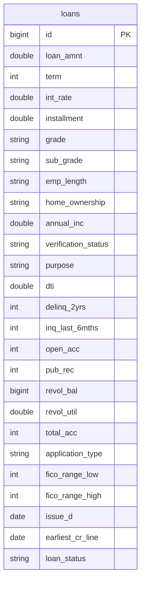


### EDA Aggregation Tables

These tables are created by Stage 2 HiveQL queries executed against the `loans` Hive table and stored as managed ORC tables in `team25_projectdb`. Their aggregated results are exported to `output/q1.csv`–`output/q6.csv` and connected to Apache Superset as datasets for visualization.

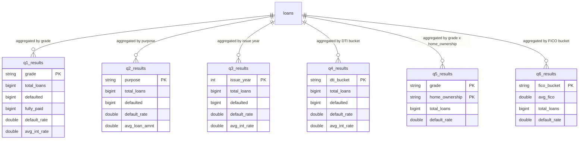


### ML Result Tables

These tables are populated by the Stage 3 Spark ML pipeline and registered as external Hive tables in Stage 4. They capture dataset characteristics, feature metadata, class distributions, and model evaluation results.

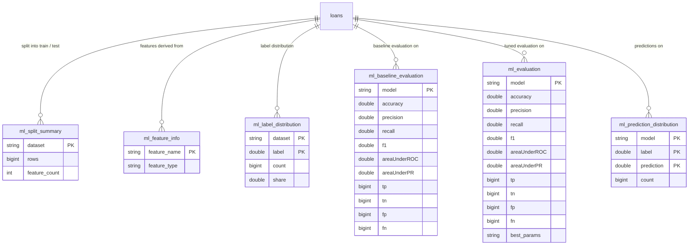


---

## Sample Data

The following rows were retrieved directly from the `loans` PostgreSQL table using the query below. They illustrate the value formats and ranges for the 12 most representative columns after preprocessing.

```sql
SELECT
    id, loan_amnt, term, int_rate, grade, home_ownership,
    annual_inc, dti, fico_range_low, purpose, loan_status, issue_d
FROM loans
LIMIT 5;
```

| id | loan\_amnt | term | int\_rate | grade | home\_ownership | annual\_inc | dti | fico\_range\_low | purpose | loan\_status | issue\_d |
| --- | --- | --- | --- | --- | --- | --- | --- | --- | --- | --- | --- |
| 68407277 | 3,600 | 36 | 13.99 | C | MORTGAGE | 55,000 | 5.91 | 675 | debt\_consolidation | Fully Paid | 2015-12-01 |
| 68355089 | 24,700 | 36 | 11.99 | C | MORTGAGE | 65,000 | 16.06 | 715 | small\_business | Fully Paid | 2015-12-01 |
| 68341763 | 20,000 | 60 | 10.78 | B | MORTGAGE | 63,000 | 10.78 | 695 | home\_improvement | Fully Paid | 2015-12-01 |
| 66310712 | 35,000 | 60 | 14.85 | C | MORTGAGE | 110,000 | 17.06 | 785 | debt\_consolidation | Current | 2015-12-01 |
| 68476807 | 10,400 | 60 | 22.45 | F | MORTGAGE | 104,433 | 25.37 | 695 | major\_purchase | Fully Paid | 2015-12-01 |

---

## Architecture of Data Pipeline

The pipeline is a five-phase, end-to-end distributed workflow. Raw data originates from an external public archive and flows through local preprocessing, relational ingestion, HDFS-based distributed storage, Hive-managed analytical tables, Spark ML modeling, and finally an interactive Superset dashboard delivered to business stakeholders.

### Technology Stack


| Layer                 | Technology                          |
| --------------------- | ----------------------------------- |
| Data Source           | Yandex Disk                         |
| Preprocessing         | Python (`filter_dataset_for_pg.py`) |
| Relational DB         | PostgreSQL (`team25_projectdb`)     |
| Ingestion Transfer    | Apache Sqoop                        |
| Distributed Storage   | HDFS + Parquet + Snappy             |
| Data Warehouse        | Apache Hive                         |
| Distributed Analytics | PySpark ML                          |
| Visualization         | Apache Superset                     |


### Pipeline Diagram

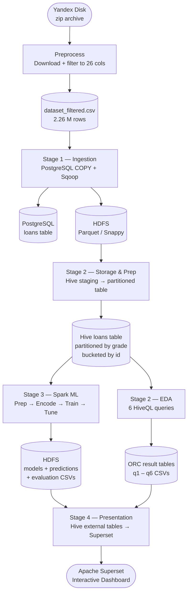


### Stage Inputs and Outputs


| Stage      | Script          | Input                   | Key Process                                                                                        | Output                                                                      |
| ---------- | --------------- | ----------------------- | -------------------------------------------------------------------------------------------------- | --------------------------------------------------------------------------- |
| Preprocess | `preprocess.sh` | Yandex Disk zip archive | Download, unzip, select 26 columns, normalize types                                                | `data/dataset_filtered.csv` (2.26 M rows)                                   |
| Stage 1    | `stage1.sh`     | `dataset_filtered.csv`  | PostgreSQL bulk load via `COPY`; Sqoop export with 4 mappers                                       | PostgreSQL `loans` table; HDFS `/user/team25/loans/*.parquet`               |
| Stage 2    | `stage2.sh`     | HDFS Parquet            | Hive staging table → timestamp fix → partitioned/bucketed table; 6 EDA HiveQL queries              | Hive `loans` table (7 grade partitions × 8 id buckets); `output/q1–q6.csv`  |
| Stage 3    | `stage3.sh`     | Hive `loans` table      | PySpark feature engineering, 70/30 split, minority upsampling, grid search (27 combos × 3-fold CV) | 3 tuned models on HDFS; evaluation + prediction CSVs in `output/dashboard/` |
| Stage 4    | `stage4.sh`     | Stage 3 HDFS CSVs       | Register 6 external Hive tables; connect datasets to Superset                                      | Interactive 3-tab Superset dashboard                                        |


All stages are idempotent — each one drops and recreates its outputs before running — orchestrated end-to-end by `main.sh`, with execution logs written to `logs/`.

---

## Stage 1 - Data Collection and Ingestion

The goal of this stage is to collect the raw dataset, load it into a relational database, and transfer it to HDFS for distributed processing. The entire workflow is driven by two scripts, `preprocess.sh` and `stage1.sh`, and runs end-to-end without manual steps.

### Data Collection

The raw dataset is downloaded from a public Yandex Disk share using the Yandex Disk public API. The script `download_from_yandex_disk.py` resolves the share URL to a temporary direct download link, fetches the zip archive, and writes it to the `data/` directory. The archive is then extracted to produce `data/dataset.csv`. No credentials or third-party CLI tools are required.

### Preprocessing

The raw file contains 151 columns, of which we retain 26 that are available at loan origination time and are relevant to the prediction task. The script `filter_dataset_for_pg.py` applies three normalization steps before the data reaches the database: date strings in `Mon-YYYY` format are converted to ISO `YYYY-MM-DD`; the `term` field (e.g. `"36 months"`) is reduced to a plain integer; and percent signs are stripped from rate fields such as `int_rate` and `revol_util`. Rows with a missing `id` or an unparseable date are dropped. The cleaned data is written to `data/dataset_filtered.csv`.

### Relational Database

The table `loans` has 26 columns with types chosen to match the data: `BIGINT` for the primary key, `DOUBLE PRECISION` for continuous financial values, `DATE` for temporal fields, `INTEGER` for count fields, and `TEXT` for categorical fields. Five CHECK constraints enforce domain integrity: non-negative values for count columns, correct FICO range ordering (`fico_range_low` ≤ `fico_range_high`), positive loan term, non-negative revolving balance, and valid numeric ranges for rates and amounts. The script `load_postgres.py` reads the table DDL and CHECK constraints from `sql/create_table.sql`, drops and recreates the table to guarantee idempotency, bulk-loads the filtered CSV using the `COPY FROM STDIN` statement via `psycopg2`, and runs `ANALYZE` to update planner statistics.

### HDFS Ingestion

The script `stage1.sh` transfers the PostgreSQL table to HDFS using **Apache Sqoop**. Before each import, the target directory is cleared with `hdfs dfs -rm -rf` to ensure the pipeline can be re-run cleanly. Sqoop reads the table with 4 parallel mappers, splitting the work by the `id` column.

### File Format and Compression

We use **Parquet** format with **Snappy** compression for all HDFS data. Parquet's columnar layout limits I/O to the columns each query actually reads, while Snappy's fast decompression keeps query latency low at the cost of a slightly larger file than gzip. This combination suits the read-heavy workload of this pipeline, where the dataset is ingested once but queried many times.

### Results

The `loans` table was loaded into the `team25_projectdb` PostgreSQL database with 2,260,701 rows. Sqoop exported the table to HDFS at `/user/team25/loans` as a Snappy-compressed Parquet file. A copy of the Parquet file is archived in the `output/` directory of the repository.

---

## Stage 2 - Data Storage and Preparation

The goal of this stage is to register the HDFS Parquet data in Apache Hive, apply the necessary type corrections, and organize the dataset into a partitioned and bucketed table optimized for analytical queries. The entire workflow is driven by `scripts/load_hive.py` and `scripts/stage2.sh`, and runs end-to-end without manual steps.

### Hive Database

The script `load_hive.py` creates the Hive database `team25_projectdb` in the metastore via `CREATE DATABASE IF NOT EXISTS`. All managed table data is written to `HIVE_WAREHOUSE_DIR` (`/user/team25/project/hive/warehouse`), which is distinct from the Sqoop import path (`/user/team25/loans`) to keep raw ingestion data and Hive-managed data in separate HDFS locations.

#### Staging Table

`staging_table_1` is an external Parquet table whose `LOCATION` points directly at the Sqoop output directory. It exposes the dataset with the raw Sqoop column types: `issue_d` and `earliest_cr_line` are represented as `BIGINT` millisecond timestamps, which is how Sqoop serializes `DATE` columns into Parquet. The table is dropped at the end of the pipeline; the underlying HDFS files are not modified.

#### Type Conversion

An intermediate managed table `staging_table_2` is created from `staging_table_1` via CTAS. The two timestamp columns are converted to native `DATE` values using `CAST(TO_DATE(FROM_UNIXTIME(CAST(col / 1000 AS BIGINT))) AS DATE)`, which divides milliseconds to seconds before applying the Unix epoch conversion. All 25 remaining columns are carried through unchanged. The table is dropped once its data has been transferred into the final partitioned table.

#### Partitioned and Bucketed Table

The final table `loans` is an external table partitioned by `grade` and clustered by `id` into 8 buckets, stored as Snappy-compressed Parquet under `HIVE_WAREHOUSE_DIR/loans`.

The `grade` column was chosen as the partition key because it is a bounded seven-value categorical (A–G) that directly encodes the Lending Club credit risk tier. Partitioning on `grade` means queries filtered by risk level - common in both exploratory analysis and model evaluation - scan only the relevant partition rather than the full dataset. Seven partitions are small enough to avoid NameNode metadata pressure while producing meaningful data slices of roughly 323 K rows each on average.

Bucketing by `id` with 8 buckets per partition was chosen because `id` is the primary key and has a uniform distribution, making it ideal for hash-based splitting. Eight buckets yield approximately 39 K rows per file, which is large enough for Tez to process efficiently without incurring small-file overhead. Bucketing by the primary key also enables efficient map-side joins in future Spark stages if a secondary lookup table keyed on `id` is introduced.

The table is declared `EXTERNAL` so that the curated data at `HIVE_WAREHOUSE_DIR/loans` survives a `DROP TABLE` during a pipeline re-run; only the metastore entry is removed. Dynamic partitioning (`hive.exec.dynamic.partition=true`, mode `nonstrict`) lets a single `INSERT INTO loans PARTITION (grade) SELECT ... FROM staging_table_2` populate all seven grade partitions without per-partition queries.

### Exploratory Data Analysis

Six HiveQL queries are executed against the `loans` Hive table to surface patterns relevant to default prediction and portfolio management. Each query stores its aggregated results in a dedicated managed ORC table (`q1_results` through `q6_results`) and exports them to `output/q1.csv`–`output/q6.csv`. The results are visualized in Apache Superset using diverse chart types: bar, horizontal bar, line, heatmap, and bubble chart. All queries restrict analysis to completed loans with a known final outcome - `Fully Paid`, `Charged Off`, `Default`, and their policy-exception variants - to ensure the denominator reflects only resolved cases.

#### Default Rate by Loan Grade

The bar chart (Q1) plots default rate and average interest rate for each of Lending Club's seven grade tiers (A–G). Default rate rises monotonically from 6% at grade A to 50% at grade G, and average interest rate tracks the same gradient from 7% to 28%. The parallel movement of interest rate and default rate confirms that Lending Club's pricing model accurately captures credit risk: borrowers assigned a higher-risk grade are charged proportionally higher rates. From a prediction standpoint, `grade` is the single strongest categorical predictor available at origination time, and the seven-value partition structure of the Hive table means grade-filtered queries run with no full-table scans.

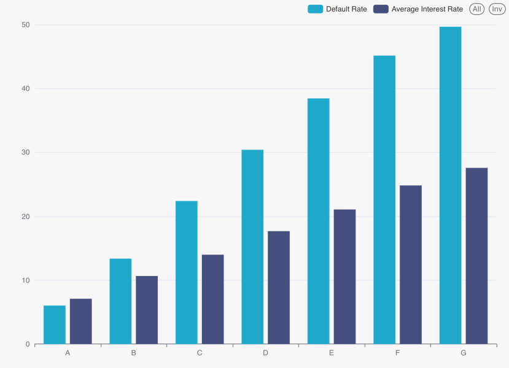

#### Default Rate by Loan Purpose

The horizontal bar chart (Q2) ranks all 14 loan purposes by default rate alongside their loan volumes. `small_business` loans carry the highest default rate at approximately 30%, followed by `renewable_energy` and `moving` at around 23%. The safest purposes are `wedding` and `car` at 12–14%. `debt_consolidation` dominates the portfolio by volume - nearly 800 thousand completed loans - yet sits at a moderate 21% default rate, close to the dataset average. The divergence between volume and risk makes purpose a useful feature: the most common loan purpose is not the riskiest, so the model must treat this as a categorical signal rather than a proxy for data density.

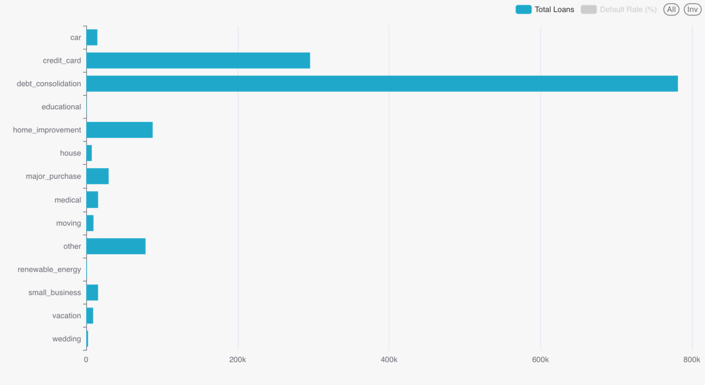

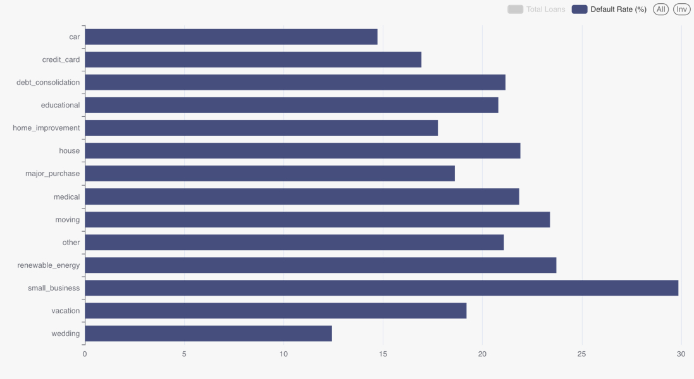

#### Default Rate over Time

The line chart (Q3) tracks completed-loan volume and default rate by issue year from 2007 to 2018. Loan issuance grew from a few thousand records in 2007 to a peak of roughly 375 thousand in 2015, then declined as the dataset ends partway through 2018. The default rate began at approximately 26% in 2007 - a small early cohort with elevated risk - dropped sharply to around 14% in 2008–2010 as post-financial-crisis underwriting tightened, and then gradually climbed back to 23% by 2016–2017 as Lending Club expanded its borrower base. The apparent decline to 16% in 2018 is an artifact of loan immaturity: recently issued loans have not had sufficient time to default, so the completed-loan filter underrepresents defaults for the most recent cohorts. 

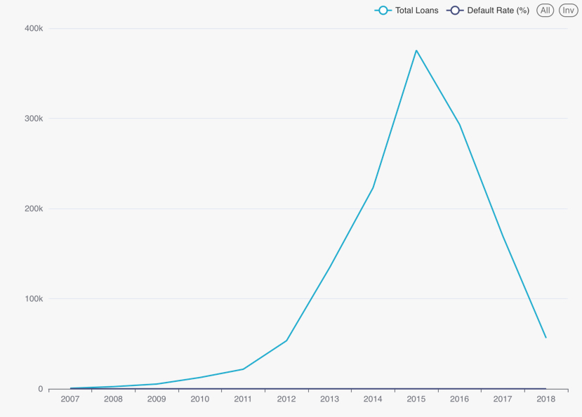

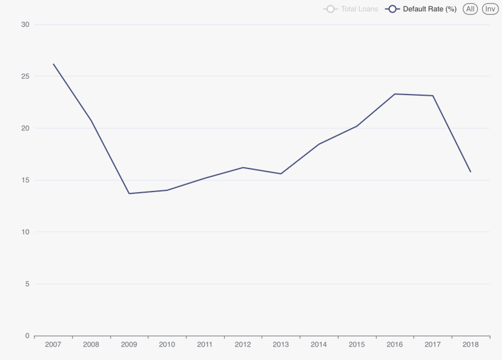

#### Default Rate by Debt-to-Income Ratio

The bar chart (Q4) groups borrowers into five DTI buckets (0–10, 10–20, 20–30, 30–40, 40+) and plots the default rate for each. The relationship is near-monotonic: 15% for the lowest bucket, rising through 18%, 23%, and 29%, to 31% for DTI above 40. Each 10-point increment in DTI adds approximately 4–5 percentage points to the default rate, making DTI the strongest continuous numeric predictor in the dataset. Two known data quality issues were handled in the query: DTI values of −1 and 999, present in a small number of records, are excluded with a `dti >= 0 AND dti <= 100` filter.

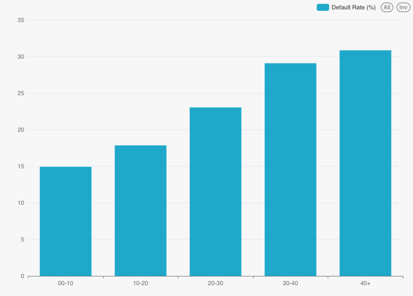

#### Interaction Effect: Grade and Home Ownership

The heatmap (Q5) shows default rates for all 21 combinations of loan grade (A–G, columns) and home ownership status (MORTGAGE, OWN, RENT, rows). The grade gradient dominates: default rates span roughly 40 percentage points across the A-to-G axis within every ownership category. Within each grade, however, home ownership provides a consistent secondary signal. MORTGAGE borrowers default least (grade A: 5.19%, grade G: 45.13%), OWN borrowers fall in the middle (6.79% to 49.86%), and RENT borrowers default most (7.34% to 54.5%). The within-grade spread across ownership categories ranges from approximately 2 percentage points at grade A to 9 percentage points at grade G, indicating that housing stability adds predictive value beyond the grade label alone, particularly for higher-risk borrowers.

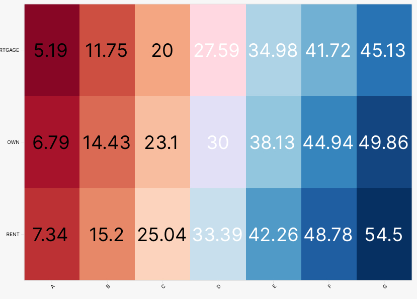

#### FICO Score and Default Risk

The bubble chart (Q6) plots average FICO score against default rate for six score buckets (610–650 through 750+), with bubble area proportional to the number of completed loans in each bucket. The relationship is monotonically negative and nearly linear: default rate falls from approximately 32% at the 610–650 bucket to 9% at 750+, with subsequent 25-point FICO increments reducing the default rate by around 4–5 percentage points. The 675–700 bucket is the largest, reflecting the concentration of Lending Club's borrower base in the near-prime credit range. The small 610–650 bubble confirms that very low FICO scores are rare in the accepted-loan population - consistent with Lending Club's minimum credit score requirements - but when they occur they carry a disproportionately high default rate.

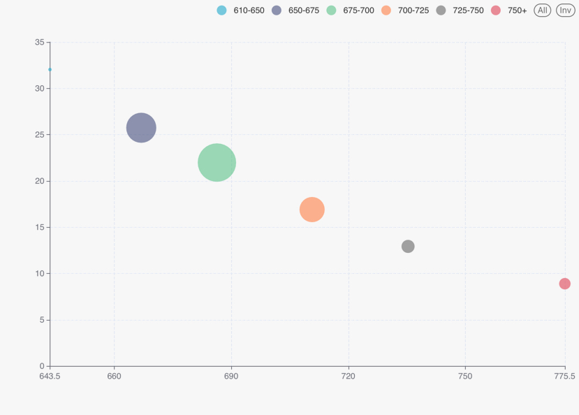

## Stage 3 - Predictive Data Analytics

The goal of this stage is to build, tune, evaluate, and compare distributed machine learning models for loan default prediction. The predictive analytics pipeline is implemented with **PySpark ML** and executed on the Hadoop YARN cluster using `spark-submit --master yarn`, so all preprocessing, training, cross-validation, and evaluation steps are performed on distributed Spark DataFrames.

The target variable is `loan_status`, which is converted into a binary label. Loans with status `Fully Paid` are assigned label `0`, while loans with status `Charged Off` are assigned label `1`. Other loan statuses, such as `Current`, `Late`, `Default`, and grace-period statuses, are excluded from the modeling dataset because they do not represent a clean finalized binary repayment outcome. After this filtering step, the modeling dataset contains only loans with known final outcomes.

### Data Preparation for Machine Learning

The Stage III pipeline starts from the curated Parquet data produced by the previous stages. The script `prepare_raw_ml_dataset.py` reads the distributed data from HDFS, restores temporal fields to Spark date types where necessary, derives time-based features, selects approval-time variables, and saves a prepared binary classification dataset to HDFS.

The selected features include borrower income, loan amount, term, interest rate, installment, debt-to-income ratio, credit account statistics, FICO score range, employment length, home ownership, verification status, loan purpose, application type, grade, sub-grade, and temporal information. The modeling feature set is restricted to variables that are available at loan origination time. This avoids target leakage from post-origination fields such as recovery amounts, collection events, hardship information, settlement data, or late-payment history.

The fields `issue_d` and `earliest_cr_line` are used to derive additional features for the model. From `issue_d`, the pipeline extracts both `issue_year` and `issue_month`. To reflect the cyclical relationship between months, `issue_month` is further encoded with sine and cosine transformations.

`issue_month_sin = sin(2π × issue_month / 12)`

`issue_month_cos = cos(2π × issue_month / 12)`

In addition, the feature `credit_history_months` is calculated as the number of months between the loan issue date and the borrower’s earliest credit line. This preserves the temporal information in a model-friendly format.

The script `build_train_test_datasets.py` performs the remaining preparation steps. First, the prepared dataset is split into training and test sets using a **70/30** ratio with a fixed random seed for reproducibility. Missing values are imputed using the mode computed **from the training split only**; the same imputation map is then applied to the test split. This prevents data leakage from the test set into preprocessing. Categorical variables are encoded with `StringIndexer` and `OneHotEncoder`, and all numeric and encoded categorical features are assembled into a single Spark ML feature vector using `VectorAssembler`.

Since the classification task is imbalanced, the final training dataset is balanced after the train/test split using upsampling of the minority class. The test set is never balanced or modified, so all reported evaluation metrics are computed on the original, naturally imbalanced test distribution. The final encoded training dataset is saved to `ML_TRAIN_ENCODED_PATH`, and the unchanged encoded test dataset is saved to `ML_TEST_ENCODED_PATH`.

The pipeline also produces dashboard-ready metadata artifacts. These include the split summary, feature list, and class distribution tables:

- `split_summary.csv`
- `feature_info.csv`
- `label_distribution.csv`

These files are later used in Apache Superset to display the number of data instances, number of features, feature names, and class balance at different stages of the pipeline.

### Feature Engineering and Encoding

The final feature vector contains **98 assembled features** after one-hot encoding categorical variables and combining them with numeric features. The original input feature groups are:

- numeric financial and credit-history variables;
- categorical borrower and loan attributes;
- engineered datetime features.

The categorical variables are indexed and one-hot encoded using a Spark ML pipeline. The numeric variables are passed directly into the `VectorAssembler`. The same fitted preprocessing pipeline is applied to both training and test data, ensuring consistent feature representation.

The selected numeric features are:

`loan_amnt`, `term`, `int_rate`, `installment`, `annual_inc`, `dti`, `delinq_2yrs`, `inq_last_6mths`, `open_acc`, `pub_rec`, `revol_bal`, `revol_util`, `total_acc`, `fico_range_low`, `fico_range_high`, `issue_year`, `issue_month`, `issue_month_sin`, `issue_month_cos`, and `credit_history_months`.

The selected categorical features are:

`grade`, `sub_grade`, `emp_length`, `home_ownership`, `verification_status`, `purpose`, and `application_type`.

### Baseline Models

Before hyperparameter tuning, three baseline models are trained to verify that the full pipeline works end-to-end and to establish reference performance. The baseline models are:

1. **Random Forest Classifier**
2. **Linear Support Vector Classifier**
3. **Naive Bayes Classifier**

All three models are trained on the encoded training dataset and evaluated on the encoded test dataset. For Naive Bayes, an additional `MinMaxScaler` transformation is applied before training because Spark’s Naive Bayes implementation requires non-negative input features, while the general feature vector contains cyclic sine/cosine features that may be negative.

The baseline evaluation results are shown below.


| Model         | Accuracy | Precision | Recall | F1     | ROC-AUC | PR-AUC |
| ------------- | -------- | --------- | ------ | ------ | ------- | ------ |
| Random Forest | 0.5878   | 0.2881    | 0.7210 | 0.4117 | 0.6918  | 0.3448 |
| Linear SVC    | 0.5793   | 0.2852    | 0.7321 | 0.4105 | 0.6902  | 0.3503 |
| Naive Bayes   | 0.6167   | 0.2993    | 0.6830 | 0.4162 | 0.4594  | 0.1867 |


The baseline results show that training on the balanced training split significantly increases recall for the positive class across all three models. This means that even baseline models are able to identify a much larger share of charged-off loans compared to the earlier unbalanced setup. However, this comes with lower accuracy and precision because the models produce more positive-class predictions. Therefore, accuracy alone remains insufficient for evaluating this task, and the main focus is placed on recall, F1, ROC-AUC, and PR-AUC.

### Hyperparameter Tuning and Cross-Validation

After baseline evaluation, the models are optimized using grid search with k-fold cross-validation. The tuning script `train_tuned_models.py` uses Spark ML’s `ParamGridBuilder` and `CrossValidator`. Cross-validation is performed only on the training dataset, and the test dataset is used only once for final evaluation of the selected best models. 

The optimization metric, configured via the `ML_OPTIMIZATION_METRIC` environment variable, is set to `areaUnderPR` because the positive class represents charged-off loans and the task is imbalanced.

The value of `k` is configured via the `ML_CV_FOLDS` environment variable (set to 3 for this run). For each model, we tune three hyperparameters with three candidate values each, resulting in 27 grid-search combinations per model. With 3-fold cross-validation, each model family is evaluated over 81 training runs. The selected best model is then saved to HDFS, and its predictions on the test set are exported as a one-partition CSV file containing only `label` and `prediction`.

For Random Forest, we tune `numTrees`, `maxDepth`, and `minInstancesPerNode`. These parameters control the complexity of the ensemble and the individual decision trees. `numTrees` defines how many trees are built, `maxDepth` limits how deep each tree can grow, and `minInstancesPerNode` prevents the model from creating overly small leaf nodes. This combination allows us to balance predictive power and overfitting risk while keeping the training process feasible on the YARN cluster.

For Linear SVC, we tune `regParam`, `tol`, and `aggregationDepth`. The most important model-level parameter is `regParam`, which controls regularization strength and therefore the margin complexity. The `tol` parameter controls the convergence tolerance of the optimization procedure, while `aggregationDepth` affects the distributed tree aggregation strategy used during training. We do not tune `maxIter` because the project requirements specify that the number of iterations should not be counted as a model hyperparameter.

For Naive Bayes, we tune three parameters: `smoothing`, `thresholds`, and the `max` value of the `MinMaxScaler` used in the model-specific preprocessing pipeline. The `smoothing` parameter controls additive smoothing and helps avoid zero-probability issues for rarely observed feature patterns. The `thresholds` parameter changes the decision bias between the two classes by assigning different weights to class predictions; this is especially useful for imbalanced binary classification, where the default decision threshold may favor the majority class. The scaler `max` parameter changes the upper bound of the transformed feature range, allowing us to test whether different feature scaling ranges affect the likelihood estimates and final classification behavior of the Naive Bayes model.

The tuned model artifacts are saved in HDFS as:

- `/user/team25/project/models/model1` — best Random Forest model
- `/user/team25/project/models/model2` — best Linear SVC model
- `/user/team25/project/models/model3` — best Naive Bayes model

The corresponding prediction outputs are saved in HDFS as:

- `/user/team25/project/output/model1_predictions`
- `/user/team25/project/output/model2_predictions`
- `/user/team25/project/output/model3_predictions`

The final tuned model comparison is saved in HDFS as:

- `/user/team25/project/output/evaluation`

### Tuned Model Results

The tuned models are evaluated on the unchanged test dataset using accuracy, precision, recall, F1, ROC-AUC, PR-AUC, and confusion-matrix counts. The final evaluation results are shown below.


| Model         | Accuracy | Precision | Recall | F1     | ROC-AUC | PR-AUC |
| ------------- | -------- | --------- | ------ | ------ | ------- | ------ |
| Random Forest | 0.6101   | 0.2991    | 0.7134 | 0.4215 | 0.7092  | 0.3696 |
| Linear SVC    | 0.6070   | 0.2939    | 0.6944 | 0.4130 | 0.6999  | 0.3574 |
| Naive Bayes   | 0.6174   | 0.2997    | 0.6892 | 0.4177 | 0.4583  | 0.1849 |


The tuned models behave differently from the baselines. Random Forest and Linear SVC achieve much higher recall and F1 after tuning and balancing, meaning they identify a substantially larger share of charged-off loans. This comes at the cost of lower accuracy and precision because the models now classify more loans as risky. In the context of credit risk, this trade-off can be acceptable because missing a high-risk borrower may be more costly than flagging a safe borrower for additional review.

Random Forest remains the strongest tuned model in terms of ROC-AUC and PR-AUC. Linear SVC performs close to Random Forest after tuning, with tuning improving its ROC-AUC and PR-AUC while maintaining competitive recall. Naive Bayes achieves comparable recall and F1 but has much weaker ranking quality, as shown by its lower ROC-AUC and PR-AUC.

### Model Comparison

The final comparison is based primarily on PR-AUC and ROC-AUC, because these metrics evaluate ranking quality on an imbalanced binary classification task. F1 and recall are also considered because the business goal is to detect charged-off loans.

Random Forest is selected as the best overall model because it achieves the highest tuned ROC-AUC and PR-AUC among the three models while maintaining high recall for the charged-off class. Linear SVC is a close second and may be attractive when a simpler linear decision boundary is preferred. Naive Bayes is the weakest model in terms of ranking performance, but it still provides a useful comparison point because it is computationally simple and represents a different modeling assumption.

The confusion-style prediction distribution is exported to `prediction_distribution.csv`, which allows the dashboard to display true positives, true negatives, false positives, and false negatives for each tuned model.

### Stage III Outputs

The Stage III scripts produce both HDFS artifacts and local repository artifacts.

The main HDFS outputs are:


| Artifact                          | Description                            |
| --------------------------------- | -------------------------------------- |
| `ML_PREPARED_RAW_PATH`            | prepared binary classification dataset |
| `ML_TRAIN_ENCODED_PATH`           | balanced encoded training dataset      |
| `ML_TEST_ENCODED_PATH`            | encoded test dataset                   |
| `ML_TRAIN_JSON_PATH`              | train dataset in JSON format           |
| `ML_TEST_JSON_PATH`               | test dataset in JSON format            |
| `ML_MODEL1_PATH`                  | best Random Forest model               |
| `ML_MODEL2_PATH`                  | best Linear SVC model                  |
| `ML_MODEL3_PATH`                  | best Naive Bayes model                 |
| `ML_MODEL1_PRED_PATH`             | Random Forest predictions              |
| `ML_MODEL2_PRED_PATH`             | Linear SVC predictions                 |
| `ML_MODEL3_PRED_PATH`             | Naive Bayes predictions                |
| `ML_EVALUATION_PATH`              | final tuned model comparison           |
| `ML_PREDICTION_DISTRIBUTION_PATH` | prediction distribution summary        |


The local dashboard-ready CSV files are exported to `output/dashboard/`:


| File                          | Purpose                                             |
| ----------------------------- | --------------------------------------------------- |
| `split_summary.csv`           | number of rows in train/test and number of features |
| `feature_info.csv`            | feature names and feature types                     |
| `label_distribution.csv`      | class distribution before and after split/balancing |
| `baseline_evaluation.csv`     | baseline model metrics                              |
| `evaluation.csv`              | tuned model metrics                                 |
| `prediction_distribution.csv` | confusion-style prediction distribution             |


These outputs are used by the Apache Superset dashboard to visualize dataset characteristics, class balance, baseline and tuned model performance, and prediction behavior.

### Automation

The complete Stage III workflow is automated by `scripts/stage3.sh`. The script loads environment variables from `.env`, runs all Spark jobs using `spark-submit --master yarn`, stores execution logs in the `logs/` directory, and exports the final HDFS artifacts into local repository folders:

- `data/` for train/test JSON files;
- `models/` for saved Spark ML models;
- `output/` for evaluation and prediction CSV files;
- `output/dashboard/` for Superset-ready dashboard tables.

This ensures that the predictive analytics stage is reproducible and can be re-run end-to-end from a single command.

---

## Stage 4 - Presentation and Delivery

The goal of this stage is to present all analytical and modeling results in an interactive Apache Superset dashboard accessible to business stakeholders. The dashboard is divided into three tabs, each targeting a distinct audience need: **Data Description**, **Data Insights**, and **ML Modeling**.

### Data Description

This tab covers the structural characteristics of the `loans` PostgreSQL table and the cleaning steps applied before ingestion:

- **Big Number** chart - total record count of 2.26 million loans.
- **Column Datatypes** table - queries `information_schema.columns` to display the name, data type, and nullability of all 26 columns.
- **Sample Data** table - 10 rows drawn directly from the `loans` table to illustrate value formats and ranges.
- **Data Cleaning** text block - documents the transformations applied by `filter_dataset_for_pg.py`: percent signs stripped from rate fields, term strings reduced to plain integers, date fields converted from `Mon-YYYY` format to ISO dates, and rows with unparseable identifiers or dates dropped.

### Data Insights

This tab presents the six EDA charts produced by the Stage II HiveQL queries, arranged in a two-column layout:

- **Line chart** - default rate and loan volume trend by issue year (Q3).
- **Horizontal bar chart** - default rate and loan count by loan purpose (Q2).
- **Bar chart** - default rate and average interest rate by loan grade (Q1).
- **Bar chart** - default rate by debt-to-income ratio bucket (Q4).
- **Bubble chart** - average FICO score versus default rate with bubble size proportional to loan count (Q6).
- **Heatmap** - default rate for all combinations of loan grade and home ownership status (Q5).

### ML Modeling

This tab is organized into three sections.

#### Characteristics of Data

This section presents the feature extraction and data preparation results:

- **Bar chart** - train and test split sizes, showing the balanced encoded training dataset at approximately 1.4 million rows after upsampling versus roughly 404 thousand rows in the unchanged test set.
- **Pie chart** - feature type breakdown: 20 numeric and 7 categorical input variables.
- **Stacked horizontal bar chart** - class distribution across all six dataset stages (`full_prepared_raw`, `train_raw`, `test_raw`, `train_encoded_before_balancing`, `train_encoded`, `test_encoded`), illustrating that all stages except `train_encoded` reflect the original approximately 80/20 class imbalance, while `train_encoded` shows a near-equal split after upsampling.

#### Optimization and Evaluation Results

This section presents the hyperparameter optimization and model evaluation results:

- **Text block** - describes the grid search setup: cross-validation configuration, optimization metric, a 27-combination parameter grid per model, and the winning hyperparameters found for each model.
- **Grouped bar chart (tuned models)** - compares ROC-AUC, F1, and PR-AUC for the best Random Forest, Linear SVC, and Naive Bayes models after grid search.
- **Grouped bar chart (baseline models)** - the same metrics for the baseline versions of all three models, placed side by side with the tuned chart to make the improvement from grid search immediately visible.

#### Prediction Results

This section presents the per-model prediction behavior on the test set:

- **Confusion matrix heatmap - Random Forest** - predicted class on the x-axis, true class on the y-axis, cell brightness proportional to count.
- **Confusion matrix heatmap - Linear SVC** - same layout as above.
- **Confusion matrix heatmap - Naive Bayes** - same layout as above.

### Key Findings

The dashboard brings together the EDA and ML results into a coherent narrative for business stakeholders. Several findings stand out across the analysis.

**Credit grade is the dominant risk signal.** Default rate rises monotonically from 6% at grade A to 50% at grade G, and average interest rate tracks this gradient almost exactly. This confirms that Lending Club's grading model captures credit risk accurately, and it makes `grade` the single most informative feature available at origination time.

**DTI and FICO score provide strong continuous signals.** Each 10-point increment in DTI adds roughly 4–5 percentage points to the default rate, from 15% at DTI 0–10 up to 31% above 40. FICO score shows the mirror image: default rate drops from 32% at the 610–650 bucket to 9% at 750+, with near-linear spacing between buckets. Both variables are available at loan approval time and are meaningful on their own even before encoding.

**Loan purpose and home ownership add secondary predictive value.** Small-business loans carry a 30% default rate — more than twice the rate of wedding or car loans — despite representing a modest share of loan volume. Within each grade tier, MORTGAGE borrowers consistently default less than RENT borrowers, with the spread widening at higher-risk grades (up to 9 percentage points at grade G).

**Temporal non-stationarity is present and material.** Default rates varied substantially from 2007 to 2018, dropping to 14% in the post-crisis years and climbing back toward 23% by 2016–2017. This confirms that the loan population is not stationary over time, and a production model would need periodic retraining or a time-aware evaluation strategy to remain reliable.

**Random Forest is the best-performing model across all ranking metrics.** After hyperparameter tuning, it achieves a ROC-AUC of 0.7092 and PR-AUC of 0.3696, outperforming Linear SVC and Naive Bayes on both metrics. Upsampling the minority class on the training data substantially increased recall for charged-off loans across all three model families, confirming that handling class imbalance is essential for this task. Naive Bayes, while competitive on accuracy and F1, shows significantly weaker ranking quality (ROC-AUC 0.4583), making it unsuitable as a scoring model for tiered loan decisions.

### Automation

The Stage IV Hive registration step is automated by `scripts/stage4.sh`. The script loads environment variables from `.env` and executes `scripts/load_ml_hive_tables.py`, which reads the six HDFS CSV directories produced by Stage III and registers them as external Hive tables in the `team25_projectdb` database using the DDL defined in `sql/ml_results.hql`. The registered tables - `ml_split_summary`, `ml_feature_info`, `ml_label_distribution`, `ml_baseline_evaluation`, `ml_evaluation`, and `ml_prediction_distribution` - are connected directly to Superset as datasets, so the dashboard charts query live Hive data rather than static files.

---

## Conclusion

### Summary

This project delivered an end-to-end distributed big data pipeline for loan default prediction using the Lending Club accepted loans dataset. Starting from 2,260,701 records and 151 raw features, we selected 26 origination-time variables and built a fully automated five-stage pipeline.

Data was downloaded from Yandex Disk, cleaned and normalised by Python preprocessing scripts, and bulk-loaded into a PostgreSQL relational database. Apache Sqoop transferred the data to HDFS in Snappy-compressed Parquet format. Apache Hive registered the dataset as an external table partitioned by loan grade and bucketed by loan ID, enabling efficient analytical queries. Six HiveQL exploratory queries revealed key patterns: default rates rise monotonically from 6% at grade A to 50% at grade G, DTI adds roughly 4–5 percentage points of default risk per 10-point increment, and default rates exhibit significant year-over-year variation, signalling temporal non-stationarity in the data.

For predictive modelling, PySpark ML on a YARN cluster was used to engineer 98 features from the 26 raw columns, split the data 70/30, balance the training set by upsampling the minority class, and train three model families — Random Forest, Linear SVC, and Naive Bayes. Each model was tuned using grid search over 27 hyperparameter combinations with cross-validation optimised for PR-AUC. Random Forest achieved the best results with a ROC-AUC of 0.7092 and PR-AUC of 0.3696. All results were exposed through a three-tab Apache Superset dashboard covering data description, EDA insights, and ML modeling.

### Reflections

The pipeline delivered on its core goals: it is fully automated, idempotent, and runs end-to-end from a single `main.sh` command. Several design decisions strengthened the analytical quality of the work. Missing value imputation was computed exclusively from the training split and then applied to the test split, preventing data leakage. The test set was never balanced or modified, ensuring that all reported evaluation metrics reflect the true deployment distribution. Cyclical sine/cosine encoding of the issue month and the derived `credit_history_months` feature added temporal signal that a raw column selection would have missed. Partitioning the Hive table by grade made EDA queries significantly more efficient by eliminating full-table scans for the most common filter condition.

At the same time, the project has clear limitations. A random 70/30 split was used. Since individual loan records are independent, this is not methodologically incorrect — it does not introduce data leakage — but it means the evaluation may not fully reflect a realistic deployment setting where the model scores future applicants it has never seen by time period. A time-based split would make the evaluation more representative of production conditions. Model diversity was also limited: only three relatively simple families were evaluated, and gradient boosting — which typically performs strongly on tabular credit data — was not included. The grid search was constrained to 27 parameter combinations per model by cluster memory limits, leaving a large portion of the hyperparameter space unexplored.

### Challenges and Difficulties

1. **Class imbalance (~80/20)** — The dataset contains roughly four times as many fully-paid loans as charged-off ones. Training on imbalanced data caused models to collapse toward majority-class predictions. This was addressed by upsampling the minority class on the training split only and adopting PR-AUC as the primary optimisation metric, which is more informative than ROC-AUC for imbalanced tasks.
2. **Temporal non-stationarity** — Default rates vary significantly across issue years, making a random train/test split less representative of a real production setting.
3. **Sqoop DATE serialisation** — Sqoop serialises PostgreSQL DATE columns as BIGINT millisecond timestamps when writing Parquet files. This required an explicit `CAST(TO_DATE(FROM_UNIXTIME(CAST(col / 1000 AS BIGINT))) AS DATE)` conversion step when creating the Hive staging table, which was a non-obvious source of type mismatch errors during development.
4. **Feature leakage avoidance** — The raw dataset contains 151 columns, many of which record post-origination events such as recovery amounts, hardship flags, settlement data, and late-payment history. Manually identifying and excluding all leaky columns required careful review of the data dictionary to ensure that the final feature set contains only information available at loan approval time.
5. **Data quality issues** — A small number of records contained DTI values of −1 and 999, which are sentinel codes rather than real measurements. These required explicit range filters (`dti >= 0 AND dti <= 100`) in EDA queries to avoid distorting aggregate statistics.
6. **Cluster resource limits** — YARN executor memory constraints on the university cluster required setting the environment variables to limit the grid search to 27 parameter combinations per model and `ML_CV_FOLDS` to 3. Attempts to configure larger grids or more folds resulted in out-of-memory failures, forcing the hyperparameter search space to remain narrower than ideal.

### Recommendations

1. **Time-based train/test split** — Replace the random 70/30 split with a split at a fixed historical date, for example 2016-01-01, so that the model is trained on older loan cohorts and evaluated on more recent ones. This aligns the evaluation with the real deployment scenario, where a model trained today will be applied to future loan applications.
2. **Gradient boosting models** — Add a Spark-native Gradient Boosted Tree classifier or integrate XGBoost. Boosting methods consistently outperform random forests on tabular credit-risk data by correcting residual errors sequentially, and are likely to yield a meaningful improvement in PR-AUC over the current best model.
3. **Expanded feature engineering** — Derive a borrower region from the ZIP-code prefix available in the full dataset, join macroeconomic indicators such as the unemployment rate and Federal funds rate matched to the `issue_d` field, and explore interaction terms between grade and DTI to capture risk-tier-specific sensitivity to leverage.
4. **Probability calibration** — Apply Platt scaling or isotonic regression to the model's raw output scores so that they can be interpreted directly as default probabilities. Calibrated probabilities are more useful for loan pricing, tiered approval workflows, and regulatory reporting than uncalibrated decision scores.
5. **Model monitoring and retraining** — Implement a drift-detection step that periodically compares the feature distribution of newly issued loans to the training baseline. When significant distributional shift is detected — for example, a change in the average DTI or FICO distribution of applicants — an automated alert should trigger model retraining on the updated data.
6. **Wider hyperparameter search** — Replace the fixed grid search with random search or Bayesian optimisation. These strategies explore a substantially larger parameter space within the same compute budget by avoiding the exhaustive enumeration of a regular grid, and are more likely to find configurations that improve PR-AUC beyond what the current 27-combination grid achieves.

---

## Team Contributions


| Project Task              | Task Description                                                                                                                                                                                                                                                               | Nikita Tiurkov | Egor Chernobrovkin | Said Kadirov | Nurmukhammet Adagamov | Deliverables                                                                                                                                           | Avg. Hours Spent |
| ------------------------- | ------------------------------------------------------------------------------------------------------------------------------------------------------------------------------------------------------------------------------------------------------------------------------ | -------------- | ------------------ | ------------ | --------------------- | ------------------------------------------------------------------------------------------------------------------------------------------------------ | ---------------- |
| Data collection           | Download the Lending Club dataset from Yandex Disk public share and verify the raw archive contents                                                                                                                                                                            | 20%            | 50%                | 0%           | 30%                   | `data/dataset.csv`, `scripts/download_from_yandex_disk.py`                                                                                             | 2                |
| Data preprocessing        | Select 26 origination-time columns from 151, normalise date formats, strip percent signs from rate fields, convert term strings to integers, drop rows with missing IDs or unparseable dates                                                                                   | 60%            | 0%                 | 0%           | 40%                   | `data/dataset_filtered.csv`, `scripts/filter_dataset_for_pg.py`                                                                                        | 3                |
| PostgreSQL ingestion      | Design the `loans` DDL with appropriate column types and five CHECK constraints, bulk-load the filtered CSV via `COPY FROM STDIN`, run `ANALYZE`                                                                                                                               | 50%            | 0%                 | 0%           | 50%                   | PostgreSQL `loans` table, `sql/create_table.sql`, `scripts/load_postgres.py`                                                                           | 1                |
| HDFS transfer             | Configure Apache Sqoop to export the PostgreSQL table to HDFS with 4 parallel mappers, Parquet format, and Snappy compression                                                                                                                                                  | 50%            | 0%                 | 0%           | 50%                   | `/user/team25/loans/*.parquet`, `scripts/stage1.sh`                                                                                                    | 1.5              |
| Hive table setup          | Create external staging table over Sqoop output, fix BIGINT-millisecond timestamps, insert into final external table partitioned by `grade` and bucketed by `id` into 8 buckets                                                                                                | 40%            | 10%                | 0%           | 50%                   | Hive `loans` table, `sql/import_data.hql`, `scripts/load_hive.py`                                                                                      | 1.5              |
| Exploratory data analysis | Write 6 HiveQL queries (default rate by grade, purpose, issue year, DTI bucket, grade × home ownership heatmap, FICO bucket), store results as ORC tables, export CSVs                                                                                                         | 60%            | 0%                 | 40%          | 0%                    | `output/q1.csv` – `output/q6.csv`, `sql/eda/q1.hql` – `q6.hql`                                                                                         | 4                |
| ML data preparation       | Derive temporal features (`issue_year`, cyclic month encoding, `credit_history_months`), perform 70/30 train/test split, impute missing values from training split only, encode categoricals with StringIndexer + OneHotEncoder, upsample minority class on training data only | 20%            | 70%                | 0%           | 10%                   | `scripts/prepare_raw_ml_dataset.py`, `scripts/build_train_test_datasets.py`, `output/dashboard/split_summary.csv`, `output/dashboard/feature_info.csv` | 4                |
| Baseline model training   | Train Random Forest, Linear SVC, and Naive Bayes baseline models on the balanced training set, evaluate on the unbalanced test set, record accuracy, precision, recall, F1, ROC-AUC, and PR-AUC                                                                                | 0%             | 100%               | 0%           | 0%                    | `output/dashboard/baseline_evaluation.csv`, `scripts/train_baseline_models.py`                                                                         | 2                |
| Hyperparameter tuning     | Run grid search (27 combinations per model, cross-validation, PR-AUC optimisation) for all three model families, save best models to HDFS, export predictions and evaluation metrics                                                                                           | 0%             | 100%               | 0%           | 0%                    | `models/model1` – `models/model3`, `output/dashboard/evaluation.csv`, `output/dashboard/prediction_distribution.csv`, `scripts/train_tuned_models.py`  | 3                |
| Dashboard development     | Set up Apache Superset, register Hive and PostgreSQL datasets, build three-tab dashboard (Data Description, Data Insights, ML Modeling) with 15+ charts including bar charts, line chart, heatmap, bubble chart, and confusion matrix heatmaps                                 | 35%            | 35%                | 30%          | 0%                    | Superset dashboard, `scripts/load_ml_hive_tables.py`, `sql/ml_results.hql`                                                                             | 3                |
| Report writing            | Document all pipeline stages, data characteristics, EDA findings, ML methodology, and results in the project report                                                                                                                                                            | 10%            | 10%                | 70%          | 10%                   | `output/report.md`                                                                                                                                     | 6                |
